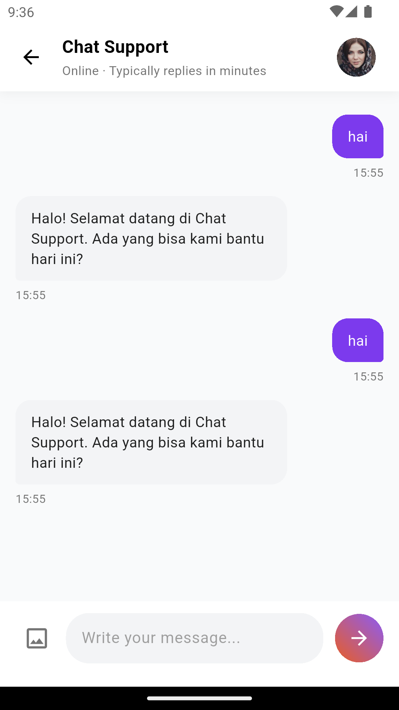
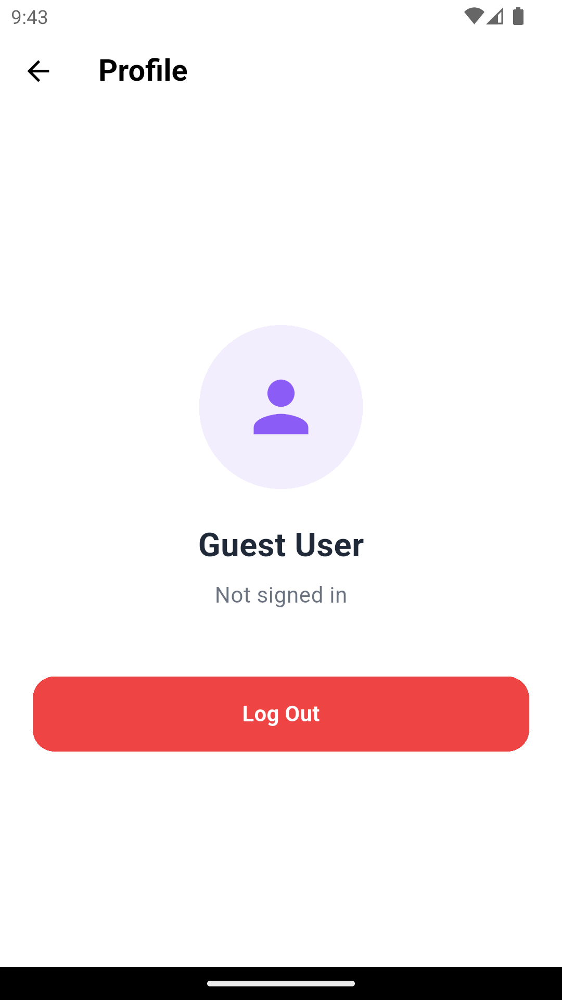

# News Chat App 📰🤖

Aplikasi Flutter premium yang menggabungkan penjelajahan Berita real-time dengan Support Chat bertenaga AI. Proyek ini dirancang dengan pendekatan **offline-first**, memastikan pengalaman pengguna yang lancar bahkan tanpa koneksi internet.

---

## 1. Ikhtisar Proyek (Project Overview)
**News Chat App** menyediakan antarmuka yang elegan bagi pengguna untuk tetap terupdate dengan berita global. Kapabilitas utama meliputi:
- **Penjelajahan Berita**: Berita real-time dari berbagai kategori (Tech, Sport, Politik, dll.).
- **Bookmark Pintar**: Simpan artikel secara lokal untuk dibaca nanti dengan respons UI instan.
- **AI Support Chat**: Chatbot interaktif untuk membantu pengguna dengan kueri menggunakan NLP berbasis aturan (rule-based).
- **Mode Offline**: Caching lokal yang komprehensif menggunakan SQLite untuk berita, bookmark, dan riwayat chat.
- **Firebase Auth**: Akses aman melalui Google Sign-In dan Guest login.

---

## 📸 Screenshots
| Login Page | News Dashboard | Detail News |
| :---: | :---: | :---: |
|  |  |  |

| Bookmark | AI Support Chat | Profile & Logout |
| :---: | :---: | :---: |
|  |  |  |

| Politics | Tech | Sport | Entertainment |
| :---: | :---: | :---: | :---: |
|  |  |  |  |

---

## 2. Petunjuk Instalasi (Installation)
### Prasyarat
- **Versi Flutter**: ^3.24.0 (Pastikan berada di channel `stable`)
- **Dart SDK**: ^3.5.0

### Langkah-langkah
1. **Clone repositori**:
   ```bash
   git clone https://github.com/andrisilaban/news_chat_app.git
   cd news_chat_app
   ```

2. **Instal Dependensi**:
   ```bash
   flutter pub get
   ```

3. **Konfigurasi Firebase**:
   - Buat proyek di [Firebase Console](https://console.firebase.google.com/).
   - Tambahkan aplikasi **Android** dan **iOS** ke proyek Anda.
   - Unduh `google-services.json` dan letakkan di `android/app/`.
   - Unduh `GoogleService-Info.plist` dan letakkan di `ios/Runner/`.
   - Aktifkan **Google Sign-In** di pengaturan autentikasi Firebase.

4. **Pengaturan NewsAPI Key**:
   - Dapatkan API key gratis dari [NewsAPI.org](https://newsapi.org/).
   - Buka `lib/constants/config.dart` dan masukkan key Anda pada kolom `apiKey`.

---

## 3. Petunjuk Menjalankan Aplikasi (Run)
1. **Cek perangkat yang terhubung**:
   ```bash
   flutter devices
   ```

2. **Jalankan aplikasi**:
   ```bash
   flutter run
   ```
   *Catatan: Untuk pengalaman terbaik, jalankan pada perangkat fisik atau emulator performa tinggi.*

---

## 4. Struktur Folder (Folder Structure)
Proyek ini mengikuti pola arsitektur bersih (*clean architecture*) yang diatur berdasarkan fitur:

```text
lib/
├── constants/          # API endpoint, konfigurasi, dan database helper
├── features/
│   ├── auth/           # Logika Login & Auth
│   ├── headline_news/  # Daftar Berita (BLoC, Model, UI)
│   ├── bookmark/       # Manajemen Bookmark
│   ├── chat/           # Logika AI Support Chat
│   └── log_out/        # Profil Pengguna & Logout
├── service/            # Layanan inti (Firebase, Auth)
└── main.dart           # Titik masuk aplikasi
```

---

## 5. Fitur yang Diimplementasikan
- [x] **Integrasi Firebase**: Google Sign-In & Login Tamu (Guest).
- [x] **Dashboard Berita**: Berita terkategori dengan pengambilan real-time.
- [x] **Detail Berita**: Tampilan artikel lengkap dengan dukungan tautan eksternal.
- [x] **Integrasi SQLite**: Penyimpanan lokal untuk Berita, Chat, dan Bookmark.
- [x] **Dukungan Offline**: Fungsionalitas penuh saat jaringan terputus.
- [x] **AI Chatbot**: Sistem bantuan berbasis aturan dengan indikator pengetikan.
- [x] **Pengujian Otomatis**: Tes integrasi untuk alur pengguna end-to-end.

---

## 6. Petunjuk Pengujian (Testing)
Proyek ini mencakup tes integrasi otomatis yang mensimulasikan alur pengguna nyata (Login -> Jelajah -> Bookmark -> Chat).

### Cara menjalankan tes:
1. Pastikan emulator atau perangkat sudah berjalan.
2. Jalankan skrip yang tersedia:
   ```bash
   ./run_tests.sh
   ```
   *Atau secara manual melalui flutter*:
   ```bash
   flutter test integration_test/app_test.dart
   ```

---

## 7. Catatan Tambahan (Additional Notes)
- **Aktivasi API Key**: API key NewsAPI gratis mungkin membutuhkan beberapa menit untuk aktif. Jika muncul error `401`, mohon tunggu sebentar dan coba lagi.
- **Perilaku Mode Offline**: Saat offline, aplikasi menandai artikel sebagai "Cached" dan memungkinkan penjelajahan konten yang sudah dimuat sebelumnya. Fitur Bookmark dan riwayat Chat tetap interaktif sepenuhnya.
- **Masalah Umum (Troubleshooting)**:
  - **Firebase**: Pastikan sidik jari SHA-1 sudah ditambahkan dengan benar agar Google Sign-In berfungsi di Android.
  - **Penyimpanan Emulator**: Jika aplikasi gagal diinstal, pastikan emulator memiliki sisa memori internal minimal 500MB.
  - **CocoaPods**: Pada macOS, jalankan `cd ios && pod install` jika menemukan error build iOS.

---

Dikembangkan oleh **Andrianto** 👨‍💻
